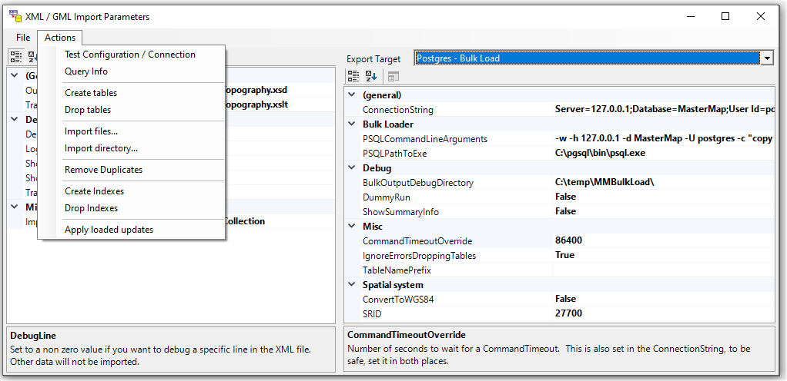
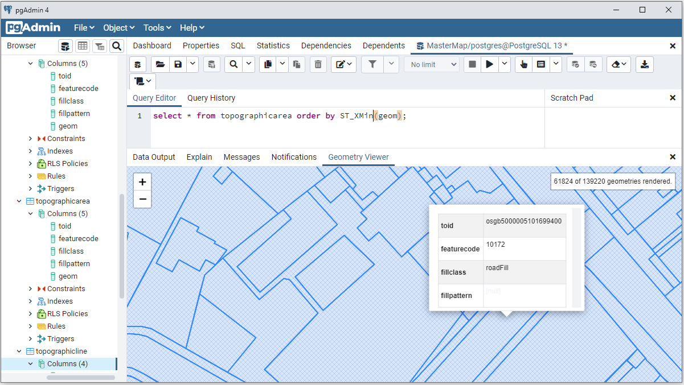
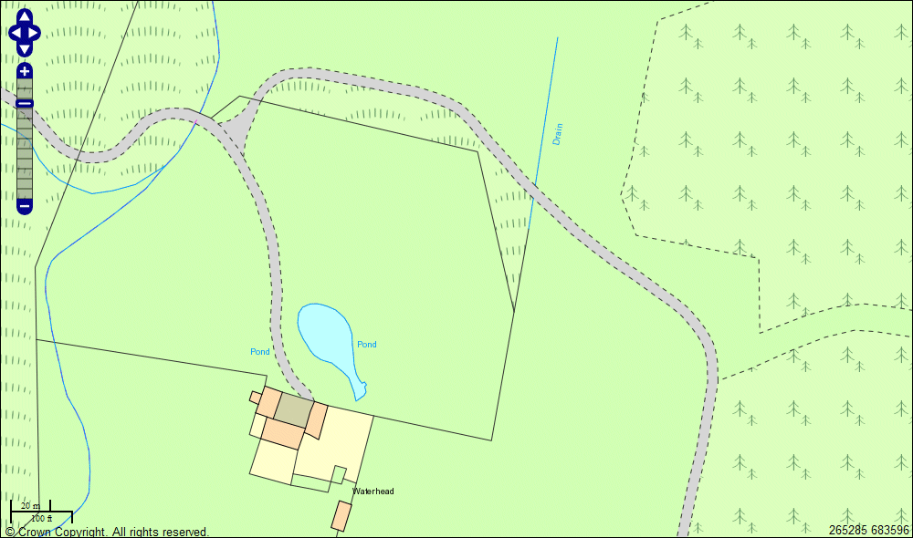

# Edonica MasterMap Importer
## What does this do?
- Allows users to quickly import large Ordnance Survey vector datasets such as the [Topography Layer](https://www.ordnancesurvey.co.uk/business-government/tools-support/mastermap-topography-support) and apply the recommended cartographic styling.
## What problem is it solving?
- Ordance Ordnance Survey MasterMap comes in large zipped XML files
- They publish a defined styling of the data in XSLT
- UK organisations have difficulty processing the files and can burn lots of money and time.
- Engineers take shortcuts conclude that structured data is slow, and incur technical debt
## How does do it?
- Streams content from zipped XML ([GML](https://www.ogc.org/standards/gml)) files
- Applies an [XSLT](https://www.w3.org/TR/xslt-30/) transform to each element
- Streams content into a bulk load target (e.g. [Postgres](https://www.postgresql.org/) / [PostGIS](https://postgis.net/) using [NPGSQL](https://www.npgsql.org/)

## What does that look like?
First load some data using the UI like this ...

Then you can see the data including styling like this ...

Then you can configure a rendrer, for example with [UMN MapServer](https://www.edonica.com/ImportingData/UMNMapServer.html) and OpenLayers

## Other Notes
This was originally hosted [here](https://www.edonica.com/MMImport/index.html) and there are more notes in HTML files in the project.

## Change log May 30 2021

Migrated to .Net Core 5
- Removed references to WPF (which we were using for Point and Rect)
- Restructured file layout
- Added automated builds and ZIPed releases in GitHub to make contributions safer.
## Change log May 25 2021

Migrated to .Net 472 / NuGet / High DPI and tested with:
- Visual Studio 2019 (16.9.6)
- SQL Server 2019 Developer (some faff with native DLLs)
- PostGres 13 (13.3 running locally)

All still works with geometry visible in PGAdmin and SQL Server Management Console.

